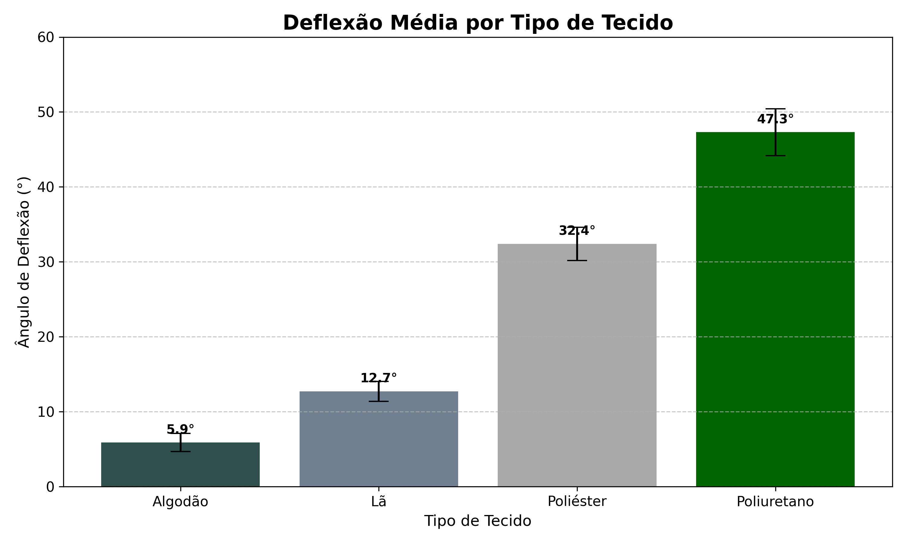

# 🔬 Análise Eletrostática de Tecidos

Este projeto apresenta uma análise de dados completa sobre o comportamento eletrostático de diferentes tecidos após atrito, utilizando estatísticas descritivas, visualização de dados e testes de hipóteses. Foi desenvolvido como parte da disciplina **Base Experimental das Ciências Naturais (BECN)** na UFABC.

---

## 📌 1. Problema de Pesquisa

**Qual a capacidade relativa de diferentes tecidos (Algodão, Lã, Poliéster e Poliuretano) de acumularem carga eletrostática por atrito?**

---

## 💡 2. Hipótese

Com base na **série triboelétrica**, nossa hipótese é:

- **Poliuretano** acumulará a maior carga eletrostática negativa.
- **Poliéster** ficará em segundo lugar.
- **Algodão**, por ser neutro, será o menos eletrizado (controle).

---

## 🧪 3. Metodologia

- **Instrumento**: Eletroscópio de folhas.
- **Medição**: Ângulo de deflexão (°) das folhas de alumínio.
- **Interpretação**: Quanto maior o ângulo, maior o acúmulo de carga.

Foram simulados **10 experimentos por tecido**, com variação para refletir erros experimentais reais.

---

## 📊 4. Visualização dos Dados

- As barras representam a **média da deflexão**.
- As linhas de erro indicam o **desvio padrão** de cada material.

---

## 📈 5. Estatísticas Descritivas

| Tecido       | Média (°) | Desvio Padrão (°) |
|--------------|-----------|-------------------|
| Algodão      | 6.0       | 1.25              |
| Lã           | 12.7      | 1.34              |
| Poliéster    | 32.4      | 2.22              |
| Poliuretano  | 47.3      | 2.98              |

---

## 🧠 6. Análise Estatística

### 🔎 Teste ANOVA (Análise de Variância)

- **Hipótese Nula (H₀)**: Todos os grupos têm a mesma média.
- **Resultado**: p < 0.0001 → **Rejeitamos H₀** → Há diferenças estatísticas.

### 🧪 Teste de Tukey HSD (Post-Hoc)

| Comparação               | Diferença Média (°) | Significância |
|--------------------------|---------------------|---------------|
| Algodão vs Lã            | -6.7                | Significativa |
| Algodão vs Poliéster     | -26.4               | Significativa |
| Algodão vs Poliuretano   | -41.3               | Significativa |
| Lã vs Poliéster          | -19.7               | Significativa |
| Lã vs Poliuretano        | -34.6               | Significativa |
| Poliéster vs Poliuretano | -14.9               | Significativa |

---

## ✅ 7. Conclusão

A análise confirma a hipótese inicial:

**Ordem de eletrização dos tecidos (menor → maior):**

1. Algodão
2. Lã
3. Poliéster
4. Poliuretano

---

## 🛠️ 8. Aplicações Práticas

- **Problema industrial**: O poliuretano acumula muita carga → choques eletrostáticos ao manusear.
- **Solução sugerida**: Uso de luvas com **algodão** ou tecidos condutores como carbono para dissipação de carga.

---

## 🔗 9. Acesse o Projeto

- 📂 Repositório: [github.com/luanviccs/analise-eletrostatica-tecidos](https://github.com/luanviccs/analise-eletrostatica-tecidos)
- 🌐 Apresentação online: [luanviccs.github.io/analise-eletrostatica-tecidos](https://luanviccs.github.io/analise-eletrostatica-tecidos)

---
